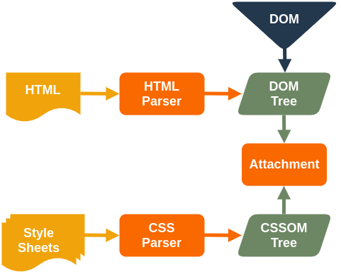
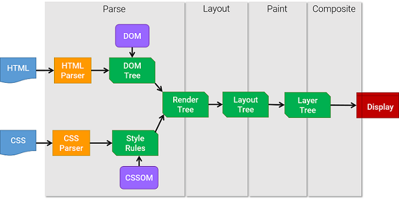

[영상자료: 우아한테크 10분 테크톡](https://www.youtube.com/watch?v=sJ14cWjrNis&t)

attachment /reflow (layout) /repainting (rasterizing)
storage 는 key value 형태인데 접근시 string으로 받아진다.. 왜?
쿠키 20개가 넘으면 어떻게 되나?
세션 스토리지와 서버의 세션과 차이점은?

## 브라우저의 렌더링 엔진에서 일어나는 과정

### DOM Tree와 CSSOM Tree 생성
1. HTML, CSS 문서를 파싱하고 DOM Tree와 CSSOM Tree 를 구성



### Attachment 단계
2. 구성된 DOM Tree와 CSSOM Tree를 합쳐 Render Tree를 만들어준다. (Attachment 과정)
```
🍳 렌더트리는 화면에 표시되어야할 컨텐츠, 스타일정보를 포함하고 있는 트리이다.
이 과정은 document 객체부터 각 노드를 순회하면서 각각의 맞는 CSSOM을 찾아 규칙을 적용 합니다.
규칙이 적용된 요소들을 하나씩 렌더 트리에 포함시키게 된다.

이때 <meta> 태그나 display: none 속성을 갖게되는 요소는 렌더 트리에 포함되지 않는다.
```

### Layout(Reflow) 단계
3. 생성된 렌더트리정보를 화면의 뷰포트 내에서 정확한 위치와 크기를 계산해 나가는과정을 거친다.
```
이때 요소의 크기를 결정 짓는 단위로 %, rem, em 등의 상대적인 단위를 사용한 경우 뷰포트에 맞게 px단위로
변환되어 적용 됩니다.
```

### Paint(Repaint/Rasterize) 단계
4. 화면의 실제 픽셀로 그려지도록 변환하는 과정을 거친다. 이 과정에서 렌더트리의 포함된 텍스트, 이미지 등이
실제 픽셀로 그져진다.

### Reflow와 Repaint
Layout이 다시 발생하는 경우 주로 요소의 크기나 위치가 바뀔 때, 혹은 브라우저 창의 크기가 바뀌었을 때 다시
이때 수치를 다시 계산하고 Reflow가 발생하고 이후 Repaint하여 화면을 그리게 된다.

