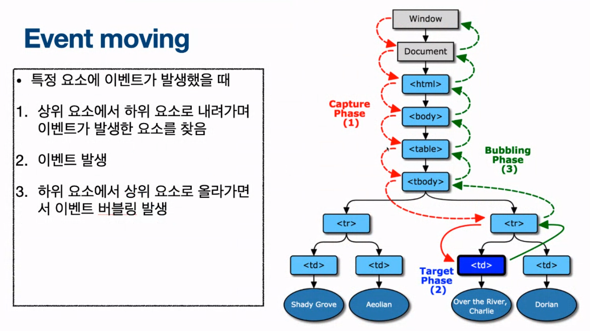
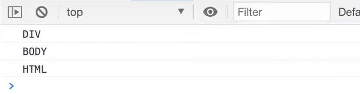
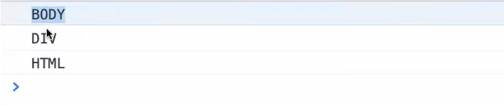

[학습자료: 김버그: DOM 이벤트 플로우 완벽하게 정리해드립니다. ](https://www.youtube.com/watch?v=7gKtNC3b_S8)

[학습자료: 캡틴판교:이벤트 버블링, 이벤트 캡처 그리고 이벤트 위임까지](https://joshua1988.github.io/web-development/javascript/event-propagation-delegation/#eventstoppropagation)

# 이벤트 플로우

## 질문의도
이벤트가 어떻게 작동하는지 버블링, 캡처링에 대한 개념을 포함하여 설명 할 수 있어야하는 질문이다.

## Capture phase와 Bubble phase 
캡처 단계와 버블 단계는 이벤트를 탐색할때의 방향이다.
이벤트가 실행되었을 때 캡처는 문서의 최상단(html) 요소 부터 최하위 요소까지 왕복으로 탐색을 진행한다.

```markdown
최상단부터 최하단으로 탐색: Capture phase
최하단부터 최상단으로 탐색: Bubble phase
```


## 이벤트가 실행되는 target phase
DOM 트리를 탐색하는 과정에서 요소에 event handler가 등록되어있다면 target phase에서 실행된다.
```markdown
이벤트 핸들러 실행: Target phase
```

## 코드로 살펴보기
```javascript
const html = document.documentElement
const body = document.body
const div = document.querySelector('div')

html.addEventListener('click', () => {
  console.log('HTML')
})

body.addEventListener('click', () => {
  console.log('BODY')
})

div.addEventListener('click', () => {
  console.log('DIV')
})
```

위와 같은 코드에서 각각의 요소에 console.log를 실행하는 이벤트 핸들러가 등록되어있다.
이때 div 요소를 클릭하면 다음과 같은 출력을 확인 할 수 있다.


출력 순서를 보면 'DIV' -> 'BODY' -> 'HTML' 순으로 출력된다.
이벤트가 최상위부터 탐색하여 이벤트를 실행하는데 왜 HTML부터 출력되지 않았을까?

## addEventListener
이벤트를 등록할때 사용한 메소드 addEventListener를 MDN 공식문서를 통해 살펴보면

```javascript
addEventListener(type, listener);
addEventListener(type, listener, options);
addEventListener(type, listener, useCapture);
```
addEventListener의 세번째 인자로 사용되는 옵셔널 설정값을 통해 해당 이벤트 대상의 DOM트리 하위에 위치한
자손으로 이벤트가 전달되지 전에 실행해야 한다는 설정을 지정할 수 있다.<br/>
이 말은 현재 기본값으로는 capture 시점이 아니라 bubble 시점에서 이벤트가 실행된다는 것을 의미한다.

- 캡처 설정방법
```javascript
html.addEventListener('click', () => {
  console.log('HTML')
}, { capture: true })

// 또는

html.addEventListener('click', () => {
  console.log('HTML')
}, true)
```

만약 body 요소의 이벤트가 capture 단계에 실행되길 바란다면 아래와 같이 이벤트 등록을 해야한다.

```javascript
const html = document.documentElement
const body = document.body
const div = document.querySelector('div')

html.addEventListener('click', () => {
  console.log('HTML')
})

body.addEventListener('click', () => {
  console.log('BODY')
}, true)

div.addEventListener('click', () => {
  console.log('DIV')
})
```

위 코드가 실행되면 출력은 'BODY' -> 'DIV' -> 'HTML' 순으로 출력된다.



## 이벤트 전파 차단하기: stopPropagation()
지금까지 알아본 event flow를 잘 이해하고 사용하면 좋겠지만 상황에 따라 복잡한 구조에서
원치 않는 이벤트 전파로 이벤트가 실행되는 경우를 더러 볼 수 있는데,
<br/>
이벤트 버블 단계에서 해당 이벤트만 실행하고 상위로 이벤트 전파되는것을 중단하기 위해서
stopProagation() 메소드를 사용 할 수 있다.

```javascript
const html = document.documentElement
const body = document.body
const div = document.querySelector('div')

html.addEventListener('click', () => {
  console.log('HTML')
})

body.addEventListener('click', () => {
  console.log('BODY')
})

div.addEventListener('click', (e) => {
  e.stopPropagation()
  console.log('DIV')
})
```

div에 등록되어있는 요소에서 상위로 이벤트가 전파되지 않도록 stopPropagation() 를 사용했을때
버블 단계에서 'DIV'를 출력한 후 더 이상 상위의 이벤트를 탐색하지 않고 해당 이벤트만 실행 할 수 있다.

## 이벤트 위임을 통한 동적 이벤트 등록: Event Delegation
만약 어떠한 리스트가 동적으로 생성되는 로직의 화면이 있다면 새롭게 추가된 요소에 이벤트 등록을
따로 등록해 줘야 할 것이다.
이러한 방법을 구현하는것이 불가능한 것은 아니지만 Event Delegation을 통해 상위의 요소에 이벤트를 등록 한
후 이벤트 캡처링과 버블링 특성을 이용해서 새롭게 등록된 요소에 이벤트를 실행시키는 방법을 구현 할 수 있다.

```html
<ul class="itemList">
	<li>
		<input type="checkbox" id="item1">
		<label for="item1">이벤트 버블링 학습</label>
	</li>
	<li>
		<input type="checkbox" id="item2">
		<label for="item2">이벤트 캡쳐 학습</label>
	</li>
</ul>

<script>
  var itemList = document.querySelector('.itemList');
  itemList.addEventListener('click', function(event) {
    alert('clicked');
  });
</script>
```