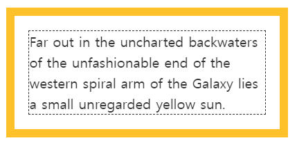
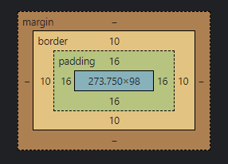
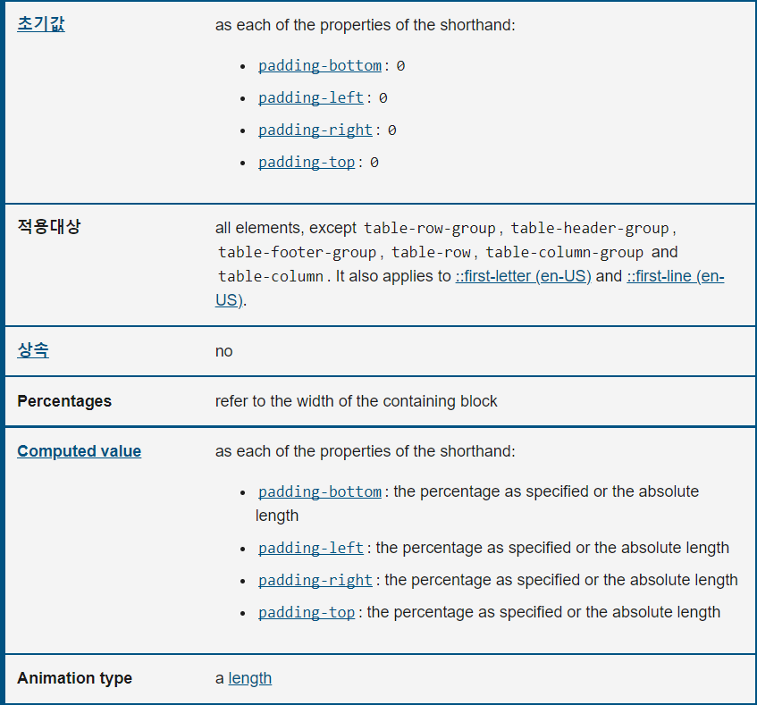
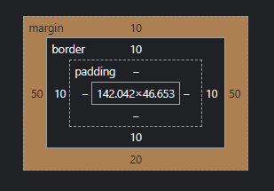

[학습자료: ]()

## padding과 margin
padding과 margin의 공통점은 '여백'과 관련된 속성이라는 것이다.<br/>
padding은 요소의 안쪽 여백을 만들고 margin은 바깥쪽 여백을 만든다.

## padding
요소의 안쪽 여백을 생성하는 CSS 속성이며,<br/>
요소의 안쪽 여백 영역은 콘텐츠와 테두리 사이의 공간이다.




- 속성 작성법 <br/>
padding 속성은 한 개, 두 개, 세 개, 혹은 네 개의 값으로 지정할 수 있고,<br/> 각 값은 \<length>, \<percentage> 중 하나로, 음수 값은 유효하지 않다.
```css
/* 네 면 모두 적용 */
padding: 1em;

/* 세로방향 | 가로방향 */
padding: 5% 10%;

/* 위 | 가로방향 | 아래 */
padding: 1em 2em 2em;

/* 위 | 오른쪽 | 아래 | 왼쪽 */
padding: 5px 1em 0 2em;

/* 전역 값 */
padding: inherit;
padding: initial;
padding: unset;

/* 각 방향 (초기값) */
padding-bottom: 0
padding-left: 0
padding-right: 0
padding-top: 0

```
- 속성 명세




## margin
margin CSS 속성은 요소의 네 방향 바깥 여백 영역을 설정한다.




## margin의 특징
- 위와 아래 여백은 인라인 요소에선 아무 효과도 없다.
- 각 값은 <length\>, <percentage\> 또는 키워드 auto 
- 음수 값은 요소와 이웃의 거리가 더 가까워지도록 한다.
- 플렉스 박스 레이아웃을 지원하지 않는 Internet Explorer 8-9 등 오래된 브라우저를 지원해야 하면 margin: 0 auto;를 대신 사용 할 수 있다.
- 두 개 요소의 위와 아래 여백은 종종 합쳐져 하나의 여백이 되고, 그 크기는 둘 중 더 큰 여백과 같아집니다.

### 마진중첩(margin-collapsing)
🍳 마진중첩과 같은 의미로 쓰이는 말
```markdown
마진병합, 마진겹침, 마진상쇄, 마진붕괘, margin-collapsing
```

#### 마진중첩 현상이 일어나는 조건
[[예제] 마진중첩 html](./margin_collapse.html)
- 인접해 있는 Block 요소 끼리만 일어난다.
- 상단 하단만 해당

#### 해결법
- 부모 요소가 block가 아닌 요소로 만든다.
- 부모 요소에 border나 padding을 적용한다.
- 부모 요소에 overflow: hidden; 속성을 사용하여 새로운 [BFC](https://developer.mozilla.org/ko/docs/Web/Guide/CSS/Block_formatting_context) 를 만든다.