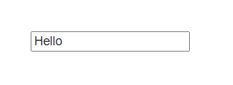

[학습자료: Front End Interview Handbook](https://frontendinterviewhandbook.com/)

## "attribute"와 "property"의 차이점은 무엇인가요?

### 사전정의
```markdown
🍳 attribute

1. [동사] (~을 …의) 결과로[덕분으로] 보다
2. [동사] (특히 말글그림 등을) …것[탓/책임]이라고 보다[말하다]
3. [명사] 자질, 속성

🍳 property
1. [명사] 재산, 소유물 (→ intellectual property, lost property, public property)
2. [명사] 부동산
3. [명사] 건물, 건물 구내
```

### 예시
```html
<!-- html의 속성을 지칭할때 attribute라고 표현 함 -->
<h1 title="Naver">네이버</h1>
```

```javascript
<!-- object의 속성을 지칭할때 property라고 표현 함 -->
const obj = {
  a: '2022'
}

obj.a // '2022'
```

attribute는 HTML 마크업에 정의되지만 property는 DOM에 정의된다.<br/>
차이점을 설명하기 위해 HTML에 다음 텍스트 필드가 있다고 가정해 보자.

```html
<input type="text" value="Hello">
```


```javascript
// 속성에 접근하는 방법 2가지
const input = document.querySelector('input');
console.log(input.getAttribute('value')); // Hello
console.log(input.value); // Hello
```

```javascript
// 텍스트 필드에 "World!"를 추가할 경우
console.log(input.getAttribute('value')); // Hello
console.log(input.value); // Hello World!
```

### 그럼 동적으로 attribute를 바꾸면 어떻게 될까?
```javascript
input.setAttribute('value', 'change world')
```

```javascript
// 텍스트 필드에 "World!"를 추가할 경우
console.log(input.getAttribute('value')); // change world
console.log(input.value); // Hello World!
```

### 결론
attribute는 HTML 문서에서 마크업된 정보를 말하고,
property는 문서를 통해 만들어진 Document Object Model의 속성으로
사용자의 인터랙션을 통해 변경된 값을 참조 할 수 있다.

attribute가 바뀐다고 해서 해당 DOM의 속성값이 바뀌는 것이 아니다.
