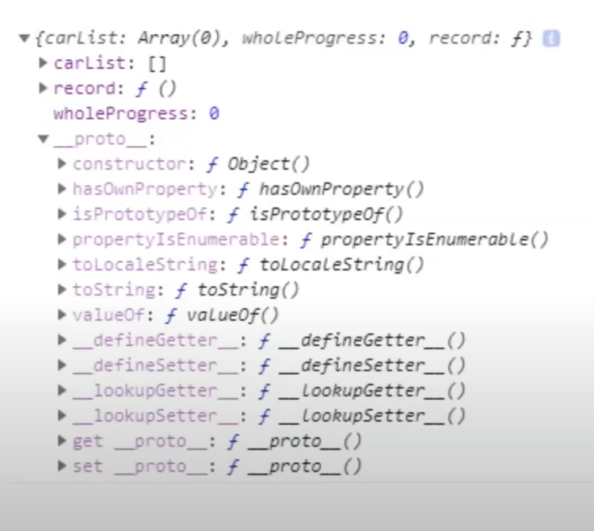
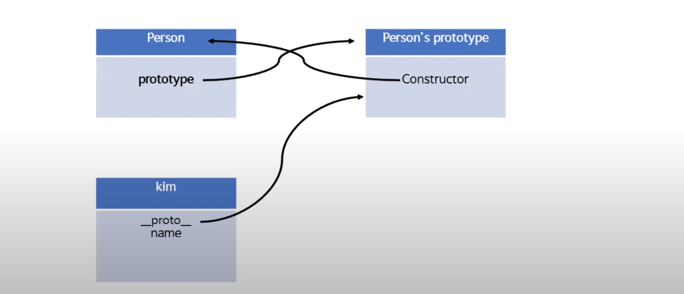

[학습자료: Front End Interview Handbook](https://frontendinterviewhandbook.com/)

[학습자료: [10분 테코톡] 💼 크리스의 Prototype](https://www.youtube.com/watch?v=RYxgNZW3wl0)

## 프로토타입 상속이 어떻게 작동하는지 설명하세요.

### 프로토타입이란?
```html
프로토타입은 클래스, 객체의 내용 복사 없이도 상속을 구현 할 수 있게 해주는 방법
```

### 프로토타입 체이닝


```html
상속 관점에서 자바스크립트의 유일한 생성자는 객체뿐이다.
각각의 객체는 [[Prototype]]이라는 은닉(private) 속성을 가지는데
자신의 프로토타입이 되는 다른 객체를 가리킨다.
그 객체의 프로토타입 또한 프로토타입을 가지고 있고 이것이 반복되다,
결국 null을 프로토타입으로 가지는 오브젝트에서 끝난다.
null은 더 이상의 프로토타입이 없다고 정의되며, 프로토타입 체인의 종점 역할을 한다.
```
프로토타입의 연결은 자신의 원형을 찾는 것의 연속으로 null 값을 만날때까지 연결한다.<br/>
이것을 <code>프로토타입 체이닝</code> 이라 한다.<br/>


```javascript
const triangle = {}
const shape = { border: 'red' }

triangle.__proto__ = shape
```

### 프로토타입 != 상속
일반적인 '일부 내용 복사' 로서의 상속

```javascript
class Person {
  constructor(name) {
    this.name = name;
  }
  
  sayHello() {
    console.log(`${this.name}님 안녕하세요!`)
  }
}

// 내용이 복사된 객체
class Crew extends Person {
  constructor(name) {
    super(name)
  }

  doCoding() {
    console.log(`${this.name}님이 코딩중입니다..`)
  }
}
```

자바스크립트에의 클래스 동작방식
```javascript
class Person {
  constructor(name) {
    this.name = name;
  }
  
  sayHello() {
    console.log(`${this.name}님 안녕하세요!`)
  }
}

// 생성자 함수
function Person(name) {
  this.name = name;
  this.sayHello = function() {
    console.log(`${this.name}님 안녕하세요!`)
  }
}

// new + 생성자 함수 = 새로운 객체를 메모리에 등록하고 __proto__ 링크가 Person 객체의 Prototype을 가리키게 됨
const kim = new Person('kim')
```



### 프로토타입 체이닝 해보기
```javascript
const a = {
  prop1: 'A의 속성'
}

const b = {
  prop2: 'B의 속성'
}

// a.prop2
a.__proto__ = b

console.log(a.prop2) // 'B의 속성'
```