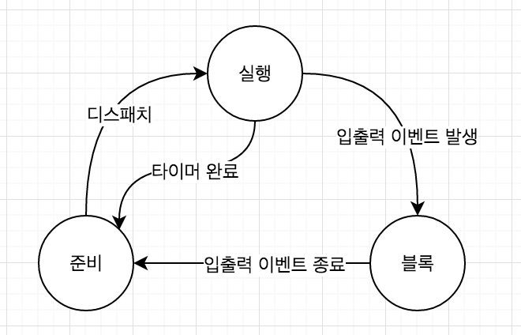

[학습자료: bowbowbow 블로그](https://bowbowbow.tistory.com/16)

## 프로세스란?
운영체제에서 프로세스는 실행되기를 기다리는 코드와 정적 데이터의 묶음(프로그램)이 실행되어 생명이 있는 상태를 프로세스라 한다.

### 프로세스는 어떻게 관리되는가?
운영체제는 프로세스들의 실행 사이에 프로세스를 교체하고 재시작할 때 
오류가 발생하지 않도록 관리해야합니다. 
이를 위해 운영체제는 프로세스의 상태를 실행(running), 준비(ready), 블록(block) 상태로 
분류하고 프로세스들을 상태전이(state transition)를 통해 체계적으로 관리합니다.



사용자가 프로그램을 실행하면 프로세스가 생성되고 준비리스트에 추가됩니다.
프로세스는 프로세서(CPU)가 사용가능한 상태가 되면 CPU를 할당받습니다.
이를 준비상태에서 실행상태로 상태전기(state transition)된다고 합니다.
이 과정을 디스패칭(dispatching)이라고 하고 디스패처가 이 일을 수행합니다.

이제 프로세스는 실행상태에서 CPU를 이용해 연산한 후 CPU를 자발적으로 반납하고 작업이 끝나지 않았으면
다시 준비상태에 들어갑니다. 운영체제는 다시 준비리스트의 첫번째에 있는 프로세스를 실행상태로
바꾸고 이 과정을 반복합니다.

만약 프로세스를 다시 사용하기 전에 입출력이 완료대기를 기다려야 하는 상황이라면 완료될때까 자신을 블록합니다. 입출력이 완료되면 운영체제가 프로세스를 블록상태에서 준비상태로 다시 전이 시킵니다.


```markdown
🍳 PID
운영체제가 각 프로세스를 식별하기 위해 부여된 프로세스 식별번호(PID, Process IDentification)입니다.
```

### 크롬 탭은 프로세스인가 쓰레드인가?
```markdown
크롬 탭은 각각이 프로세스이다.
각 탭마다 PID를 가지고 있으며, 크롬탭 중 하나의 탭이 오류가 생겼다 해서 모든 탭에 형향을 끼치지 않기 때문이다.
```
