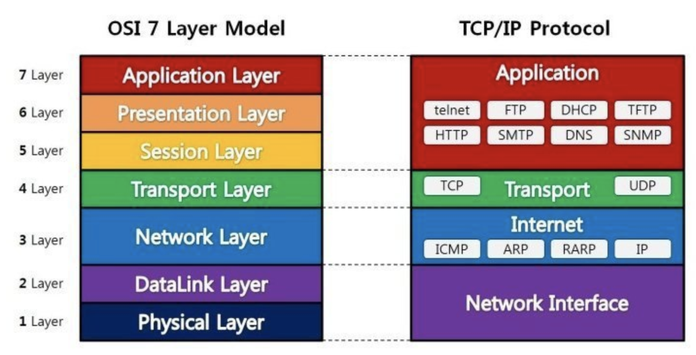

[학습자료: 망나니개발자 블로그](https://mangkyu.tistory.com/15)


네트워크의 계층 중 데이터의 전달을 담당하는 전송 계층(Transport Layer)의
TCP와 UDP 프로토콜에 대한 조사 입니다.

## TCP(Transmission Control Protocol)
인터넷상에서 데이터를 메세지의 형태로 보내기 위해 IP와 함께 사용하는 프로토콜
```markdown
- 연결형 서비스로 가상 회선 방식을 제공한다.
- 3-way handshaking과정을 통해 연결을 설정하고 4-way handshaking을 통해 해제한다.
- 흐름 제어 및 혼잡 제어.
- 높은 신뢰성을 보장한다.
- UDP보다 속도가 느리다.
- 전이중(Full-Duplex), 점대점(Point to Point) 방식.
```

## UDP(User Datagram Protocol)
데이터를 데이터그램 단위로 처리하는 프로토콜
```markdown
- 비연결형 서비스로 데이터그램 방식을 제공한다
- 정보를 주고 받을 때 정보를 보내거나 받는다는 신호절차를 거치지 않는다.
- UDP헤더의 CheckSum 필드를 통해 최소한의 오류만 검출한다.
- 신뢰성이 낮다
- TCP보다 속도가 빠르다
```
### 브라우저에 URL을 입력하면 어떤일이 발생하는가?
1. HTTP Request로 요청 처리 메시지를 보냄
2. 인터넷을 통해 해당 서버로 전달하기 위해 각 계층에 필요한 정보를 담은 패킷을 만듦
   Application Layer에서는 HTTP Request를
   Transport Layer는 시작지 포트와 목적지 포트 번호를
   Internet Layer는 시작 IP 주소와 목적 IP 주소 이때
   도메인 url 대신 목적지 IP 주소를 알기 위해 자신의 OS에서 DNS서버로 실제 목적지 IP주소를 알수있다. DNS에서 사용하는것이 UDP 프로토콜 이다.
   UPD는 비연결지향형 프로토콜로 TCP와 다르게 포트정보만 있어 헤더가 간단하다.
   마지막으로 MAC 주소를 포함한 이더넷 프로토콜에 대한 헤더를 만든다.

3. 이제 요청을 보내기 위해 연결지향형 프로토콜인 TCP에 따라 송신측과 수신측이 서로 연결되는 작업인 3-way-handshaking 을 수행한다.
다음 여러 라우터를 거처 목적지 서버까지 도달한다.

4. 목적지로 도착한 HTTP 요청에 따라 '/'에 맵핑된 GET 요청을 처리해서 적절한 HTML을 응답한다.
이 과정이 끝나면 연결을 종료하기 위해 4-way-handshaking이 진행된다.
혹시나 전달되지 못한 잉여패킷을 기다리기위해 TIME-WAIT가 진행된다.

### TCP가 필요한 이유
엄청나게 큰 데이터를 주고받을때 데이터를 작은 패킷으로 쪼개 주고받게된다.
이렇게 작은 패킷들을 복잡한 절차의 인터넷을 통해 오고 갈때 데이터가 유실되지 않고
올바른 순서에 맞게 주고받게 하기위해 TCP가 필요하다.
따라서, TCP의 흐름제어, 오류제어, 혼잡제어를 통해 신뢰성있는 데이터 전송을 보장 할 수 있다.
