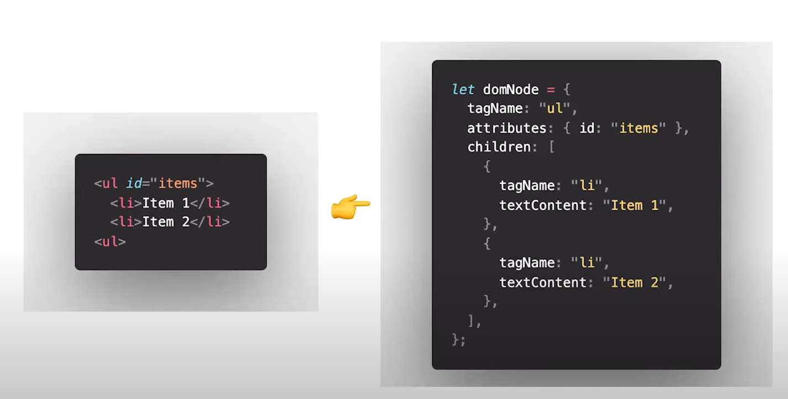

[학습자료: 10분 테코톡 🥁 지그의 Virtual DOM](https://www.youtube.com/watch?v=PN_WmsgbQCo)

# Virtual DOM에 대해 설명하세요.
위 질문은 브라우저 렌더링 과정, DOM에 대한 개념으로 꼬리질문이 가능하며, Virtual DOM의 동작 방식과
왜 사용하는지를 묻는 질문이다.

## 한줄 요약
```markdown
UI의 가상적인 표현을 메모리에 저장하고 ReactDOM과 같은 라이브러리에 의해 실제 DOM과 동기화 하는것
```

## 브라우저 렌더링 과정
1. DOM tree 생성: 렌더 엔진이 HTML을 파싱하여 DOM Node로 이루어진 트리를 생성
2. Render tree 생성: css 파일과 inline 스타일을 파싱 DOM + CSSOM = 렌더 트리를 생성
3. Layout (reflow): 각 노드들의 스크린에서 좌표에 따라 위치를 결정
4. Paint (repaint): 실제 화면에 그리기

## DOM 도작의 비효율성
유저 인터랙션을 통해 DOM에 변화가 일어나면 Render tree가 재생성되는데 이때 모든 요소의 스타일을 다시
계산하고 reflow, repaint가 이루어지는 불필요한 비용이 생긴다는 단점이 있다.

## 가상돔의 특징과 동작원리
가상돔은 DOM Object와 같은 속성을 갖고 있지만 실제 DOM Api는 갖고 있지 않고있다.
유저 인터랙션으로 변화가 생기면 전체 UI가 가상돔에 렌더링 된다.
이때 이전 가상돔에 있던 내용과 업데이트 후 내용을 비교하여 바뀐 부분만 실제 DOM에 적용 시킨다.

- 따라서, 가상돔을 통해 전체 real DOM을 바꾸지 않고도 필요한 UI의 업데이트만 적용 시킬수 있다.

## 왜 빠른가?
- 자바스크립트 객체
- 메모리상에서 동작
- 실제 렌더링 되지 않기 때문에 연산 비용이 최소화

가상돔은 자바스크립트 객체로 표현되며 메모리 상에서 동작하기때문에 실제 DOM을 렌더링하는 연산보다 빠르다.



## 어떻게 비교하는가?
Diffing 알고리즘을 통해 이전 상태과 업데이트 후 상태를 비교하여 실제 DOM에 결과를 반영하는데,

- element의 속성 값만 변한 경우는 속성 값만 업데이트
- element 태그 또는 컴포넌트가 변경된 경우는 해당 노드를 포함한 하위 모든 노드를 unmount한 후 새로운 가상돔으로 대체

## 무조건 가상돔을 사용하는것이 좋은가?
그렇지 않다.

- 인터랙션이 적은경우 혹은 없는경우
```markdown
정보 제공만 하는 웹페이지라면 인터랙션이 발생하지 않기 때문에 일반 DOM 성능이 적합 할 수 있다.
```

- SPA 프로젝트 또는 인터랙션이 많은 경우
```markdown
SPA로 제작된 큰 규모의 웹 페이지에서는 Virtual DOM을 사용해서 브라우저의 연산 양을 줄여 성능을 개선할 수 있다.
```