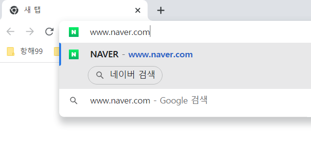
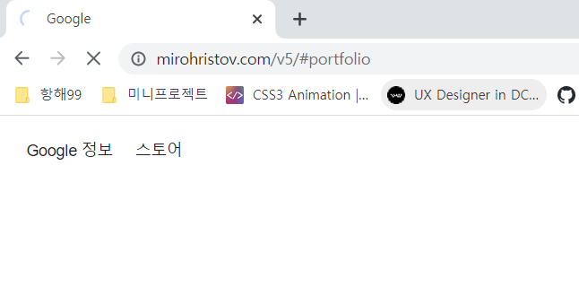
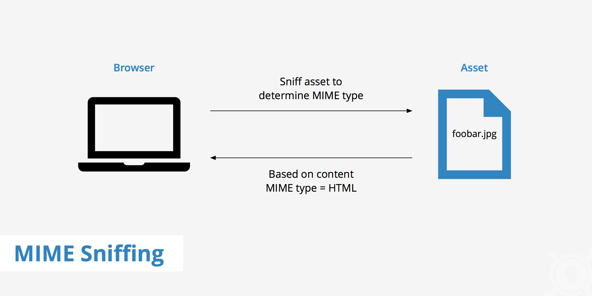

[학습자료: 가장 쉬운 웹개발 with Boaz](https://www.youtube.com/watch?v=ipwfEUslfQA)

# What happens when type google..?

### 질문의도
브라우저에 URL를 입력 후 엔터쳤을때 실제로 어떠한 과정으로 웹 페이지가 요청되는지에 대한<br/>
내용을 물어보는 질문이다.

## 설명

### 1. Handling inputs - URL창에 텍스트를 입력
- 브라우저 프로세스안의 UI 쓰레드가 입력된 텍스트가 <code>search query</code>인지 <code>URL</code>인지
판단
  - <code>search query</code>가 입력된 경우 search engine으로 query를 보내 검색을 준비
  

  - <code>URL</code>이 입력된 경우 네트워크 쓰레드로 URL값을 전달할 준비
  


### 2. Start Navigation - 사용자가 Enter키를 입력
- UI 쓰레드가 로딩 스피너가 탭 왼쪽에 그리고 네트워크 쓰레드에게 URL을 전달 -> network call initiates

- 네트워크 쓰레드가 URL 정보를 활용하여 DNS에 연결, TLS(Transport Layer Security) connection을 생성
  - HTTP 301 에러 시 네트워크 쓰레드가 UI 쓰레드에게 redirect를 전달
  - 정상적으로 응답이 왔을 경우 UI 쓰레드가 another network call initiates

### 3. Read Response - response body가 네트워크 쓰레드로 들어올때
- response header의 content-type을 확인, content-type을 정확히 확인하니 위해 MIME type sniffing 과정을 거침


- content-type을 확인하는 과정에서  
  - HTML type일 경우 Renderer 프로세스에게 파일을 전달하기 위한 준비
  - HTML type이 아닐 경우, 예를 들어 zip 파일일때 Download manager에게 파일을 전달 준비

- content-type 확인 과정이 끝난 후 안전한 페이지인지 확인하는 단계로 2가지 절차를 거친다.
  - 첫번째 SafeBrowsing
  ```markdown
  도메인과 데이터가 known malicious site(악의적인 사이트)인 경우 warning page를 보여줌
  ```
  - 두번째 CORB(Cross Origin Read Blocking)
  ```markdown
  민감한 cross-site 데이터인지를 확인하여 renderer process에게 전달할지를 결정
  ```

### 4. Find Renderer process - 네트워크 쓰레드가 확인이 끝난 후 브라우저가 사이트를 이동해야 한다면
- Read Response 단계를 거처 안정성이 확보된 데이터를 네트워크 쓰레드가 UI 쓰레드에게 전달 (data is ready 상태)
- UI 쓰레드가 Start Navigation 단계에서 찾아놓은 Renderer 프로세스에게 데이터(html file)을 전달


### 5. Commit Navigation - data, Renderer 프로세스가 준비되면
- 브라우저 프로세스가 Renderer 프로세스에게 해당 페이지 정보를 렌더링 해달라는 요청을 보낸다 (IPC)
- Renderer 프로세스가 브라우저 프로세스로 부터 commit navigation 되었다는 컨펌을 확인하면 document loading phase가 시작된다. 이 과정에서는 아래와 같은 작업이 이루어진다.
  - 주소창 업데이트 (현재 브라우저 접속 URL 변경)
  - security indicator & site settings UI reflect new page information (신뢰할수있는 페이지 아이콘 등 브라우저 UI 업데이트)
  - session history for the tab updated (history 정보를 저장하고 업데이트)
    - forward/back button에 방금 방문한 사이트 추가
    - 탭/윈도우 닫을 때 복구 기능을 위해 session history is stored on disk

### 6. Initial load complete - navigation is committed
- Renderer 프로세스는 계속 적으로 페이지 필요한 외부 자원을 로딩하고 렌더링 한다.
- 렌더링이 끝나면 UI 쓰레드에서 로딩 스피너를 탭에서 지움
